## 手写版

### 目标

不依赖框架，实现 The augmented LLM(Chat + MCP + RAG)

依赖框架：LangChain，LlamaIndex，AutoGen

## 框架版

### Langchain

Langchian的架构可以分为3层，由底层到高层分别是：

大模型接入API、工作流API、Agent API

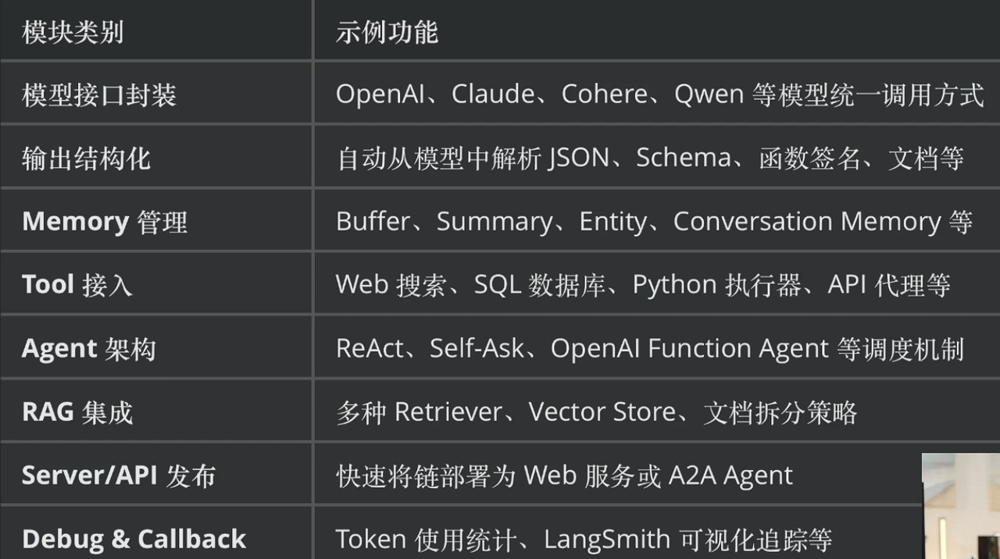

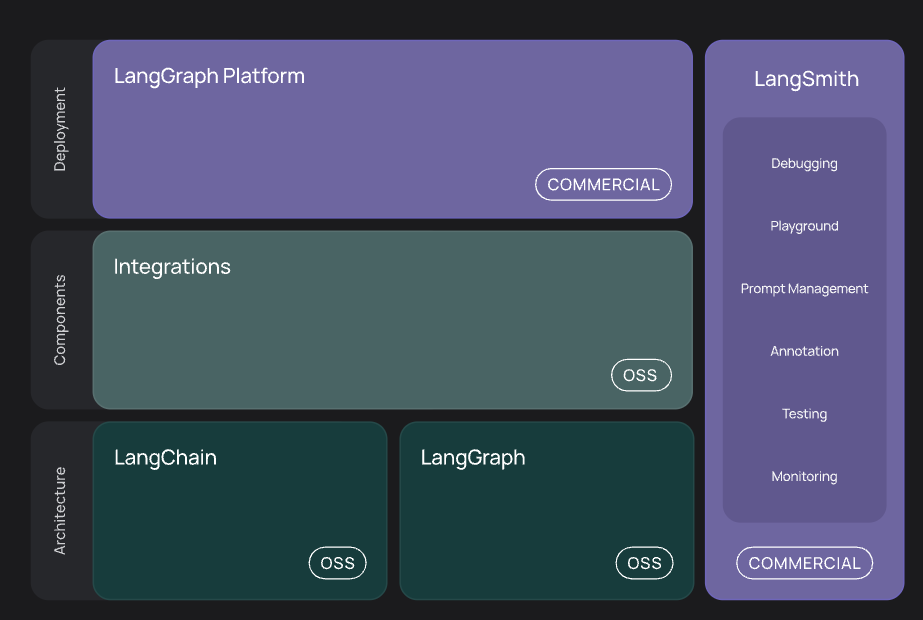

#### Langchain搭建过程

##### 接入模型

1. 下载Langchain

```bash
pip3 install langchain
```

下载好之后验证langchain版本

```bash
pip3 show langchain
```

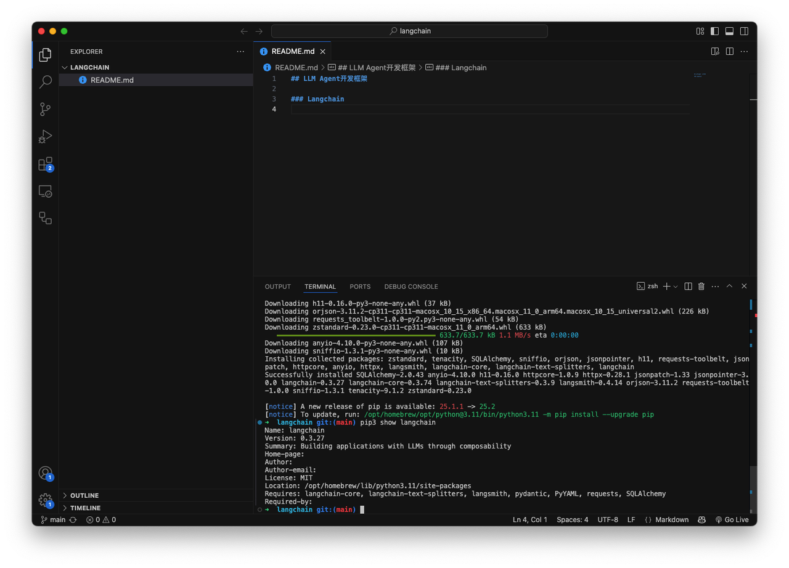

* 注册DeepSeek的**API-KEY**

* 创建好之后，在.env文件中注册这个DeepSeek的API key

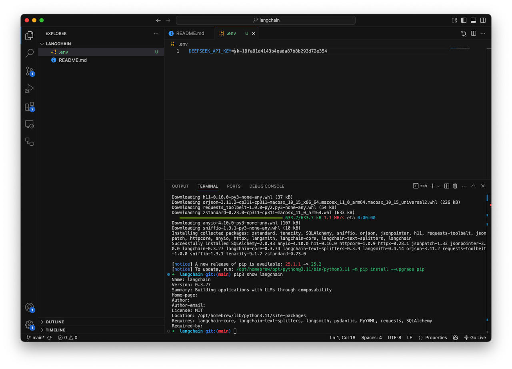

* 安装 **python-dotenv**

可以让项目能够读取dotenv文件中的项目变量

* 验证能不能顺利读取**API-KEY**

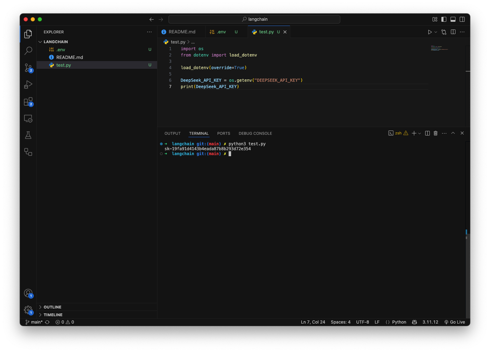

* 使用OpenAI客户端对话验证DeepSeek

  ```bash
  # 初始化OpenAI客户端
  client = OpenAI(api_key=DeepSeek_API_KEY,base_url="https://api.deepseek.com")
  # print(DeepSeek_API_KEY)

  # 调用DeepSeek API生成回答
  response = client.chat.completions.create(
      model="deepseek-chat",
      messages=[
          {"role":"system","content":"你是陕西西安人，以一个导游的身份介绍西安"},
          {"role":"user","content":"你好，请介绍自己"},
      ]
  )

  print(response.choices[0].message.content)
  ```

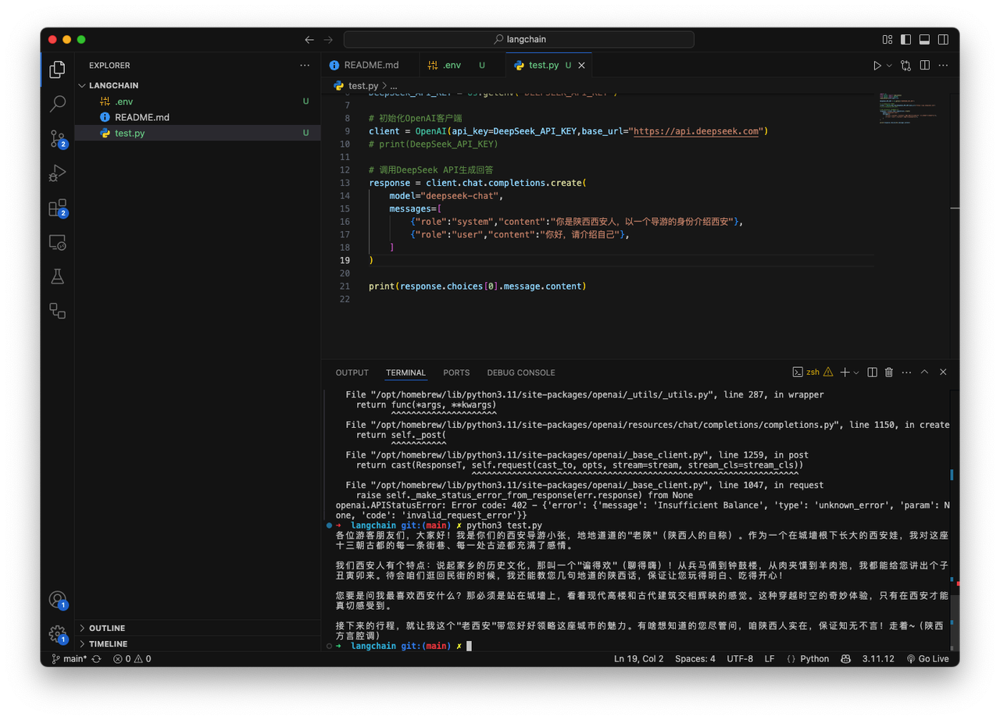

* 安装**langchain-deepseek**

* 创建模型对象

  ```bash
  # 创建一个模型对象
  from langchain.chat_models import init_chat_model

  model = init_chat_model(model="deepseek-chat",model_provider="deepseek")
  ```

* Langchain验证模型调用

* 接入Embedding模型

接Embedding模型推荐使用阿里百炼平台

##### 搭建Chains

1. base chain

   ```bash
   prompt_template = ChatPromptTemplate([("system","你是一个乐于助人的助手"),("user","这是用户的问题：{topic},请用yes或no来回答")])
   bool_qa_chain = prompt_template | model | BooleanOutputParser()

   question = "请问1+1是否大于2?"
   result = bool_qa_chain.invoke(question)
   print(result)
   ```

2. Chain with schema

   ```bash
   from langchain.output_parsers import ResponseSchema,StructuredOutputParser
   schemas = [
       ResponseSchema(name="age",description="用户的年龄"),
       ResponseSchema(name="name",description="用户名称")
   ]

   parser = StructuredOutputParser.from_response_schemas(schemas)
   prompt = PromptTemplate.from_template("请根据以下内容提取用户信息，并返回JSON格式:\n{input}\n\m{format_instructions}")
   chain = (prompt.partial(format_instructions=parser.get_format_instructions())  | model | parser)
   result = chain.invoke({"input":"用户叫刘峰"})
   print(result)
   ```


这一点很有意义，可以从输入字段中提取到JSON格式的文字&#x20;

* Complex chain

> 需要LLM编一个新闻稿，然后从新闻稿中使用LLM提取出格式化数据📊（JSON：时间、地点、事件）

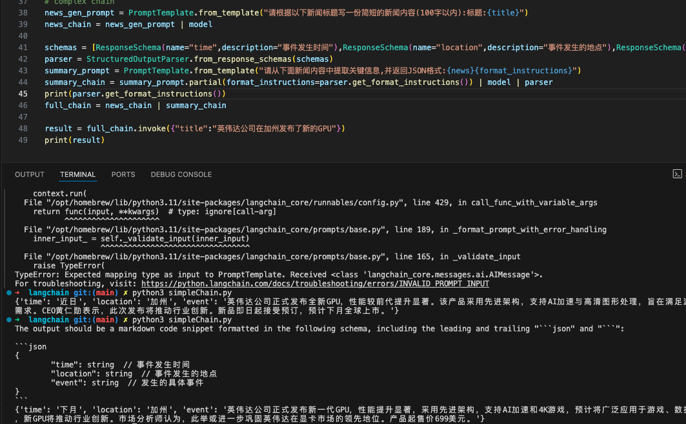

* list\_memory chain

可以进行对话的机器人

```bash
from langchain_core.messages import AIMessage,HumanMessage,SystemMessage
from langchain_core.prompts import ChatPromptTemplate,MessagesPlaceholder
from langchain_core.output_parsers import StrOutputParser

parser = StrOutputParser()
prompt = ChatPromptTemplate.from_messages(
    [SystemMessage(content="你叫小智,是一个AI助手"),MessagesPlaceholder(variable_name="messages")])
chain = prompt | model | parser
message_list = []
print("输入 exit 或 quit 结束对话")

while True:
    user_query = input("你: ")
    if user_query.lower() in {"exit","quit"}:
        break
    message_list.append(HumanMessage(content=user_query))
    assistant_reply = chain.invoke({"messages":message_list})
    print("🤖 小智：",assistant_reply)
    message_list.append(AIMessage(content=assistant_reply))
    if len(message_list) > 50:
        message_list = message_list[-50]
```

##### 有前端的Chains

前端框架选择的是基于Python的Gradio

```bash
import gradio as gr
import os
from dotenv import load_dotenv
from openai import OpenAI
from langchain.chat_models import init_chat_model
from langchain_core.output_parsers import StrOutputParser
from langchain.prompts import ChatPromptTemplate
load_dotenv(override=True)

DeepSeek_API_KEY = os.getenv("DEEPSEEK_API_KEY")

# 创建模型部分
model = init_chat_model(model="deepseek-chat",model_provider="deepseek")
system_prompt = ChatPromptTemplate.from_messages([
    ("system","你叫小智，是一名AI助手"),("human","{input}")])
qa_chain = system_prompt | model | StrOutputParser()
res = qa_chain.invoke({"input":"你是谁"})
print(res)
# response函数
async def chat_response(message,history):
    partial_message = ""
    async for chunk in qa_chain.astream({"input":message}):
        partial_message += chunk
        yield partial_message

# 创建前端页面
def crate_frontend():
    css = """
    .main-container{
        max-width:1200px;
        margin: 0 auto;
        padding: 20px
    }
    .header-text{
        text-align : center;
        margin-bottom : 20px
    }
    """
    with gr.Blocks(title="DeepSeek Chat",css=css) as demo:
        with gr.Column(elem_classes=["main-container"]):
            # 居中显示标题
            gr.Markdown(
                "# 🤖高瑜：",
                elem_classes=["header-text"]
            )
            gr.Markdown(
                "流式对话机器人",
                elem_classes=["header-text"]
            )

            chatbot = gr.Chatbot(
                height=500,
                show_copy_button=True,
                # avatar_images=(
                #     ""
                # )
            )
            with gr.Row():
                msg = gr.Textbox(
                    placeholder="请输入你的问题",
                    container=False,
                    scale=7
                )
                submit = gr.Button(
                    "发送",
                    scale=1,
                    variant="primary"
                )
                clear = gr.Button(
                    "清空",
                    scale=1
                )
        async def respond(message,chat_history):
            if not message.strip():
                yield "",chat_history
                return
            chat_history = chat_history + [(message,None)]
            # chat_history.append((message,None))
            yield "",chat_history

            async for response_chunk in chat_response(message,chat_history):
                chat_history[-1] = (message,response_chunk) 
                yield "",chat_history
        
        def clear_history():
            return [],""
        
        # msg.submit(respond,[msg,chatbot],[msg,chatbot])
        submit.click(respond,[msg,chatbot],[msg,chatbot])
        clear.click(clear_history,outputs=[chatbot,msg])
    return demo

demo = crate_frontend()
demo.launch(
    server_name="127.0.0.1",
    server_port=7860,
    share=False,
    debug=True
)
```

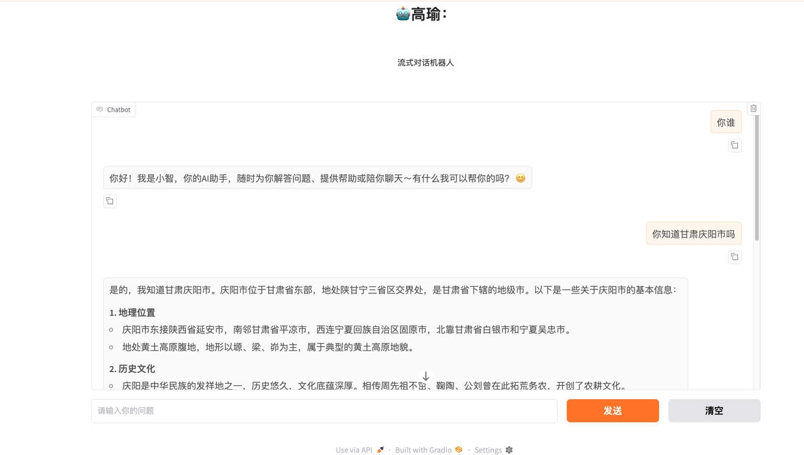

##### 案例：调用工具

LangChain封装了一套自己的工具调用方法

* Chain with Python Interpreter

场景：把对数据📊、文档📄使用内置的一个Python代码解释器来处理

将用户的白话进行一连串处理使得可以用一些Python计算库来计算得到答案

```bash
from langchain.output_parsers.boolean import BooleanOutputParser
from langchain.prompts import ChatPromptTemplate,PromptTemplate
from langchain.chat_models import init_chat_model
from langchain_experimental.tools import PythonAstREPLTool
import os
from dotenv import load_dotenv
import pandas as pd
load_dotenv(override=True)

# 加载模型API_KEY
DeepSeek_API_KEY = os.getenv("DEEPSEEK_API_KEY")
model = init_chat_model(model="deepseek-chat",model_provider="deepseek")
df = pd.read_csv("./data/WA_Fn-UseC_-Telco-Customer-Churn.csv")
# pd.set_option("max_colwidth",200)
# print(dataset.head(5))

# 使用Python解释器
tool = PythonAstREPLTool(locals={"df":df})
# res = tool.invoke("df['SeniorCitizen'].mean()")
# print(res)
llm_with_tools = model.bind_tools([tool])
# res = llm_with_tools.invoke(
#     '我有一张表，名为df，请帮我计算SeniorCitizen字段的均值'
# )
# print(res)

# 结果解析器提取Python代码
from langchain_core.output_parsers.openai_tools import JsonOutputKeyToolsParser
parser = JsonOutputKeyToolsParser(key_name=tool.name,first_tool_only=True)
llm_chain = llm_with_tools | parser

system = """
 你可以访问一个名为pandas的数据框,你可以使用df.head().to_markdown()查看数据集的基本信息,请根据用户提出的问题,编写Python代码来回答。只返回代码，不返回其他内容。只允许使用pandas和内置库
"""

prompt = ChatPromptTemplate([
    ('system',system),
    ('user',"{question}")
])

full_chain = prompt | llm_with_tools | parser | tool
res = full_chain.invoke({"question":"请帮我计算SeniorCitizen字段的均值"})
# print(res)
res2 = full_chain.invoke({"question":"请帮我分析gender,SeniorCitizen字段之间的相关关系"})
print(res2)

# 增加打印结果节点
from langchain_core.runnables import RunnableLambda
def code_print(res):
    print("即将运行Python代码",res['query'])
    return res

print_node = RunnableLambda(code_print)
full_chain_with_print = prompt | llm_with_tools | parser | print_node | tool 
full_chain_with_print.invoke({"question":"请帮我分析gender,SeniorCitizen字段之间的相关关系"})
```

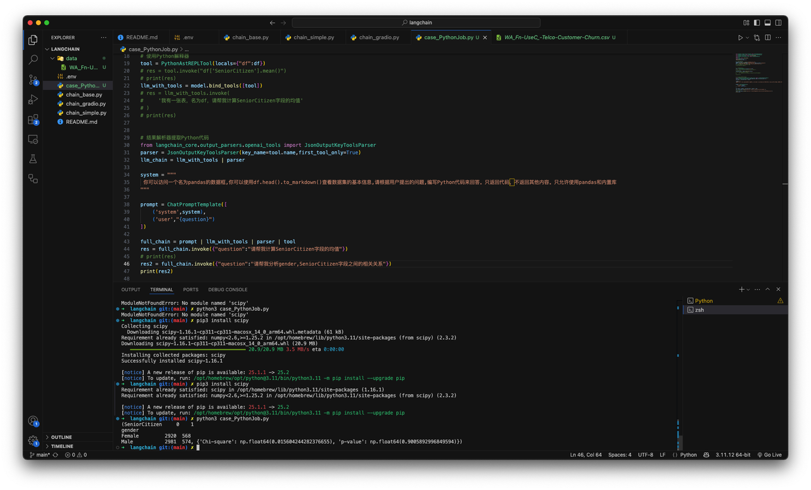

* Chain with external function tools

场景：搭建一条chain，使得能够进行天气查询

通常需要访问外部数据，那么需要提前谁知好**API\_KEY**

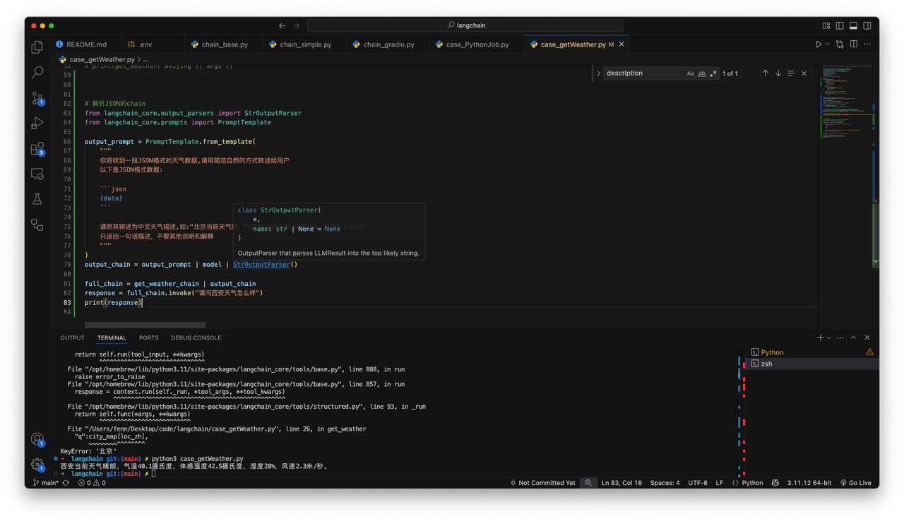

##### Agent based chain

更高层的封装

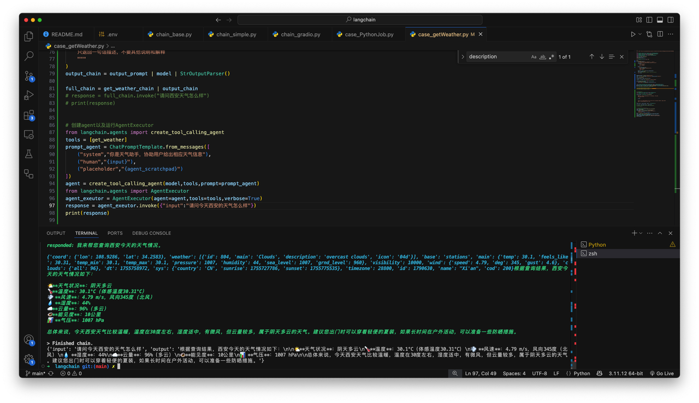

```bash
# 创建agent以及运行AgentExecutor
from langchain.agents import create_tool_calling_agent
tools = [get_weather]
prompt_agent = ChatPromptTemplate.from_messages([
    ("system","你是天气助手，协助用户给出相应天气信息"),
    ("human","{input}"),
    ("placeholder","{agent_scratchpad}")
])
agent = create_tool_calling_agent(model,tools,prompt=prompt_agent)
from langchain.agents import AgentExecutor
agent_exeutor = AgentExecutor(agent=agent,tools=tools,verbose=True)
response = agent_exeutor.invoke({"input":"请问今天西安的天气怎么样"})
print(response)
```

##### 案例：Agent 浏览器自动化爬虫

使用playwrite

```bash
pip3 install playwright beautifulsoup4 reportlab lxml

playwright install // 安装虚拟浏览器内核
```

```bash
from langchain_community.agent_toolkits import PlayWrightBrowserToolkit
from langchain_community.tools.playwright.utils import create_sync_playwright_browser
from langchain import hub
from langchain.agents import AgentExecutor,create_openai_tools_agent
from langchain.chat_models import init_chat_model
import os
from dotenv import load_dotenv
load_dotenv(override=True)

DeepSeek_API_KEY = os.getenv("DEEPSEEK_API_KEY")

## 初始化playwright浏览器
sync_playwright = create_sync_playwright_browser()
toolkit = PlayWrightBrowserToolkit.from_browser(sync_playwright)
tools = toolkit.get_tools()

## 拉提示词模版
prompt = hub.pull("hwchase17/openai-tools-agent")

model = init_chat_model("deepseek-chat",model_provider="deepseek")

agent = create_openai_tools_agent(model,tools=tools,prompt=prompt)

agent_executor = AgentExecutor(agent=agent,tools=tools,verbose=True)

if __name__ == "__main__":
    command = {
        "input":"访问这个网站 https://yaoyuanartemis.github.io/ 并总结内容"
    }
    response = agent_executor.invoke(command)
    print(response)
```

##### 案例：接入MCP

接入MCP的方式有两种：

* Function  calling

* langchain

使用Langchain是Function Caling的重写。两者都是对调度文件的表示

优点：

代码量减少很多

```bash
"""
多服务器 MCP + LangChain Agent 示例
---------------------------------
1. 读取 .env 中的 LLM_API_KEY / BASE_URL / MODEL
2. 读取 servers_config.json 中的 MCP 服务器信息
3. 启动 MCP 服务器（支持多个）
4. 将所有工具注入 LangChain Agent，由大模型自动选择并调用
"""
 
import asyncio
import json
import logging
import os
from typing import Any, Dict, List
 
from dotenv import load_dotenv
from langchain import hub
from langchain.agents import AgentExecutor, create_openai_tools_agent
from langchain.chat_models import init_chat_model
from langchain_mcp_adapters.client import MultiServerMCPClient
from langchain_mcp_adapters.tools import load_mcp_tools
 
# ────────────────────────────
# 环境配置
# ────────────────────────────
 
class Configuration:
    """读取 .env 与 servers_config.json"""
 
    def __init__(self) -> None:
        load_dotenv()
        self.api_key: str = os.getenv("LLM_API_KEY") or ""
        self.base_url: str | None = os.getenv("BASE_URL")  # DeepSeek 用 https://api.deepseek.com
        self.model: str = os.getenv("MODEL") or "deepseek-chat"
        if not self.api_key:
            raise ValueError("❌ 未找到 LLM_API_KEY，请在 .env 中配置")
 
    @staticmethod
    def load_servers(file_path: str = "servers_config.json") -> Dict[str, Any]:
        with open(file_path, "r", encoding="utf-8") as f:
            return json.load(f).get("mcpServers", {})
 
# ────────────────────────────
# 主逻辑
# ────────────────────────────
async def run_chat_loop() -> None:
    """启动 MCP-Agent 聊天循环"""
    cfg = Configuration()
    os.environ["DEEPSEEK_API_KEY"] = os.getenv("LLM_API_KEY", "")
    if cfg.base_url:
        os.environ["DEEPSEEK_API_BASE"] = cfg.base_url
    servers_cfg = Configuration.load_servers()
 
    # 把 key 注入环境，LangChain-OpenAI / DeepSeek 会自动读取
    os.environ["OPENAI_API_KEY"] = cfg.api_key
    if cfg.base_url:  # 对 DeepSeek 之类的自定义域名很有用
        os.environ["OPENAI_BASE_URL"] = cfg.base_url
 
    # 1️⃣ 连接多台 MCP 服务器
    mcp_client = MultiServerMCPClient(servers_cfg)
 
    tools = await mcp_client.get_tools()         # LangChain Tool 对象列表
 
    logging.info(f"✅ 已加载 {len(tools)} 个 MCP 工具： {[t.name for t in tools]}")
 
    # 2️⃣ 初始化大模型（DeepSeek / OpenAI / 任意兼容 OpenAI 协议的模型）
    llm = init_chat_model(
        model=cfg.model,
        model_provider="deepseek" if "deepseek" in cfg.model else "openai",
    )
 
    # 3️⃣ 构造 LangChain Agent（用通用 prompt）
    prompt = hub.pull("hwchase17/openai-tools-agent")
    agent = create_openai_tools_agent(llm, tools, prompt)
    agent_executor = AgentExecutor(agent=agent, tools=tools, verbose=True)
 
    # 4️⃣ CLI 聊天
    print("\n🤖 MCP Agent 已启动，输入 'quit' 退出")
    while True:
        user_input = input("\n你: ").strip()
        if user_input.lower() == "quit":
            break
        try:
            result = await agent_executor.ainvoke({"input": user_input})
            print(f"\nAI: {result['output']}")
        except Exception as exc:
            print(f"\n⚠️  出错: {exc}")
 
    # 5️⃣ 清理
    await mcp_client.cleanup()
    print("🧹 资源已清理，Bye!")
 
# ────────────────────────────
# 入口
# ────────────────────────────
if __name__ == "__main__":
    logging.basicConfig(level=logging.INFO, format="%(asctime)s - %(levelname)s - %(message)s")
    asyncio.run(run_chat_loop())
```

##### 案例：RAG with langchain

```bash
import streamlit as st
from PyPDF2 import PdfReader
from langchain.text_splitter import RecursiveCharacterTextSplitter
from langchain_core.prompts import ChatPromptTemplate
from langchain.tools.retriever import create_retriever_tool
from langchain_community.vectorstores import FAISS
from langchain.agents import AgentExecutor,create_tool_calling_agent
from langchain_community.embeddings import DashScopeEmbeddings
from langchain.chat_models import init_chat_model
import os
from dotenv import load_dotenv

# 找到上级目录的 .env 文件路径
from pathlib import Path
env_path = Path(__file__).resolve().parent.parent / ".env"
load_dotenv(dotenv_path=env_path,override=True)

DeepSeek_API_KEY=os.getenv("DEEPSEEK_API_KEY")
dashscope_api_key = os.getenv("DASHSCOPE_API_KEY")
 
os.environ["KMP_DUPLICATE_LIB_OK"]="TRUE"
 
 
embeddings = DashScopeEmbeddings(
    model="text-embedding-v1", dashscope_api_key=dashscope_api_key
)
 
def pdf_read(pdf_doc):
    text = ""
    for pdf in pdf_doc:
        pdf_reader = PdfReader(pdf)
        for page in pdf_reader.pages:
            text += page.extract_text()
    return text
 
 
def get_chunks(text):
    text_splitter = RecursiveCharacterTextSplitter(chunk_size=1000, chunk_overlap=200)
    chunks = text_splitter.split_text(text)
    return chunks
 
def vector_store(text_chunks):
    vector_store = FAISS.from_texts(text_chunks, embedding=embeddings)
    vector_store.save_local("faiss_db")
 
def get_conversational_chain(tools, ques):
    llm = init_chat_model("deepseek-chat", model_provider="deepseek")
    prompt = ChatPromptTemplate.from_messages([
        (
            "system",
            """你是AI助手，请根据提供的上下文回答问题，确保提供所有细节，如果答案不在上下文中，请说"答案不在上下文中"，不要提供错误的答案""",
        ),
        ("placeholder", "{chat_history}"),
        ("human", "{input}"),
        ("placeholder", "{agent_scratchpad}"),
    ])
     
    tool = [tools]
    agent = create_tool_calling_agent(llm, tool, prompt)
    agent_executor = AgentExecutor(agent=agent, tools=tool, verbose=True)
     
    response = agent_executor.invoke({"input": ques})
    print(response)
    st.write("🤖 回答: ", response['output'])
 
def check_database_exists():
    """检查FAISS数据库是否存在"""
    return os.path.exists("faiss_db") and os.path.exists("faiss_db/index.faiss")
 
def user_input(user_question):
    # 检查数据库是否存在
    if not check_database_exists():
        st.error("❌ 请先上传PDF文件并点击'Submit & Process'按钮来处理文档！")
        st.info("💡 步骤：1️⃣ 上传PDF → 2️⃣ 点击处理 → 3️⃣ 开始提问")
        return
     
    try:
        # 加载FAISS数据库
        new_db = FAISS.load_local("faiss_db", embeddings, allow_dangerous_deserialization=True)
         
        retriever = new_db.as_retriever()
        retrieval_chain = create_retriever_tool(retriever, "pdf_extractor", "This tool is to give answer to queries from the pdf")
        get_conversational_chain(retrieval_chain, user_question)
         
    except Exception as e:
        st.error(f"❌ 加载数据库时出错: {str(e)}")
        st.info("请重新处理PDF文件")
 
def main():
    st.set_page_config("🤖 LangChain B站公开课 By九天Hector")
    st.header("🤖 LangChain B站公开课 By九天Hector")
     
    # 显示数据库状态
    col1, col2 = st.columns([3, 1])
     
    with col1:
        if check_database_exists():
           pass
        else:
            st.warning("⚠️ 请先上传并处理PDF文件")
     
    with col2:
        if st.button("🗑️ 清除数据库"):
            try:
                import shutil
                if os.path.exists("faiss_db"):
                    shutil.rmtree("faiss_db")
                st.success("数据库已清除")
                st.rerun()
            except Exception as e:
                st.error(f"清除失败: {e}")
 
    # 用户问题输入
    user_question = st.text_input("💬 请输入问题", 
                                  placeholder="例如：这个文档的主要内容是什么？",
                                  disabled=not check_database_exists())
 
    if user_question:
        if check_database_exists():
            with st.spinner("🤔 AI正在分析文档..."):
                user_input(user_question)
        else:
            st.error("❌ 请先上传并处理PDF文件！")
 
    # 侧边栏
    with st.sidebar:
        st.title("📁 文档管理")
         
        # 显示当前状态
        if check_database_exists():
            st.success("✅ 数据库状态：已就绪")
        else:
            st.info("📝 状态：等待上传PDF")
         
        st.markdown("---")
         
        # 文件上传
        pdf_doc = st.file_uploader(
            "📎 上传PDF文件", 
            accept_multiple_files=True,
            type=['pdf'],
            help="支持上传多个PDF文件"
        )
         
        if pdf_doc:
            st.info(f"📄 已选择 {len(pdf_doc)} 个文件")
            for i, pdf in enumerate(pdf_doc, 1):
                st.write(f"{i}. {pdf.name}")
         
        # 处理按钮
        process_button = st.button(
            "🚀 提交并处理", 
            disabled=not pdf_doc,
            use_container_width=True
        )
         
        if process_button:
            if pdf_doc:
                with st.spinner("📊 正在处理PDF文件..."):
                    try:
                        # 读取PDF内容
                        raw_text = pdf_read(pdf_doc)
                         
                        if not raw_text.strip():
                            st.error("❌ 无法从PDF中提取文本，请检查文件是否有效")
                            return
                         
                        # 分割文本
                        text_chunks = get_chunks(raw_text)
                        st.info(f"📝 文本已分割为 {len(text_chunks)} 个片段")
                         
                        # 创建向量数据库
                        vector_store(text_chunks)
                         
                        st.success("✅ PDF处理完成！现在可以开始提问了")
                        st.balloons()
                        st.rerun()
                         
                    except Exception as e:
                        st.error(f"❌ 处理PDF时出错: {str(e)}")
            else:
                st.warning("⚠️ 请先选择PDF文件")
         
        # 使用说明
        with st.expander("💡 使用说明"):
            st.markdown("""
            **步骤：**
            1. 📎 上传一个或多个PDF文件
            2. 🚀 点击"Submit & Process"处理文档
            3. 💬 在主页面输入您的问题
            4. 🤖 AI将基于PDF内容回答问题
             
            **提示：**
            - 支持多个PDF文件同时上传
            - 处理大文件可能需要一些时间
            - 可以随时清除数据库重新开始
            """)
 
if __name__ == "__main__":
    main()
```

##### 案例：数据分析Agent

````bash
import streamlit as st
import pandas as pd
import os
from PyPDF2 import PdfReader
from langchain.text_splitter import RecursiveCharacterTextSplitter
from langchain_core.prompts import ChatPromptTemplate
from langchain_community.vectorstores import FAISS
from langchain.tools.retriever import create_retriever_tool
from langchain.agents import AgentExecutor, create_tool_calling_agent
from langchain_community.embeddings import DashScopeEmbeddings
from langchain.chat_models import init_chat_model
from langchain_experimental.tools import PythonAstREPLTool
import matplotlib
matplotlib.use('Agg')
import os
from dotenv import load_dotenv 
load_dotenv(override=True)
 
 
DeepSeek_API_KEY = os.getenv("DEEPSEEK_API_KEY")
dashscope_api_key = os.getenv("dashscope_api_key")
 
# 设置环境变量
os.environ["KMP_DUPLICATE_LIB_OK"] = "TRUE"
 
# 页面配置
st.set_page_config(
    page_title="By九天Hector",
    page_icon="🤖",
    layout="wide",
    initial_sidebar_state="expanded"
)
 
# 自定义CSS样式
st.markdown("""
<style>
    /* 主题色彩 */
    :root {
        --primary-color: #1f77b4;
        --secondary-color: #ff7f0e;
        --success-color: #2ca02c;
        --warning-color: #ff9800;
        --error-color: #d62728;
        --background-color: #f8f9fa;
    }
     
    /* 隐藏默认的Streamlit样式 */
    #MainMenu {visibility: hidden;}
    footer {visibility: hidden;}
    header {visibility: hidden;}
     
    /* 标题样式 */
    .main-header {
        background: linear-gradient(90deg, #1f77b4, #ff7f0e);
        -webkit-background-clip: text;
        -webkit-text-fill-color: transparent;
        font-size: 3rem;
        font-weight: bold;
        text-align: center;
        margin-bottom: 2rem;
    }
     
    /* 卡片样式 */
    .info-card {
        background: white;
        padding: 1.5rem;
        border-radius: 10px;
        box-shadow: 0 2px 10px rgba(0,0,0,0.1);
        margin: 1rem 0;
        border-left: 4px solid var(--primary-color);
    }
     
    .success-card {
        background: linear-gradient(135deg, #e8f5e8, #f0f8f0);
        border-left: 4px solid var(--success-color);
    }
     
    .warning-card {
        background: linear-gradient(135deg, #fff8e1, #fffbf0);
        border-left: 4px solid var(--warning-color);
    }
     
    /* 按钮样式 */
    .stButton > button {
        background: linear-gradient(45deg, #1f77b4, #2196F3);
        color: white;
        border: none;
        border-radius: 8px;
        padding: 0.5rem 1rem;
        font-weight: 600;
        transition: all 0.3s ease;
        box-shadow: 0 2px 8px rgba(31, 119, 180, 0.3);
    }
     
    .stButton > button:hover {
        transform: translateY(-2px);
        box-shadow: 0 4px 12px rgba(31, 119, 180, 0.4);
    }
     
    /* Tab样式 */
    .stTabs [data-baseweb="tab-list"] {
        gap: 8px;
        background-color: #f8f9fa;
        border-radius: 10px;
        padding: 0.5rem;
    }
     
    .stTabs [data-baseweb="tab"] {
        height: 60px;
        background-color: white;
        border-radius: 8px;
        padding: 0 24px;
        font-weight: 600;
        border: 2px solid transparent;
        transition: all 0.3s ease;
    }
     
    .stTabs [aria-selected="true"] {
        background: linear-gradient(45deg, #1f77b4, #2196F3);
        color: white !important;
        border: 2px solid #1f77b4;
    }
     
    /* 侧边栏样式 */
    .css-1d391kg {
        background: linear-gradient(180deg, #f8f9fa, #ffffff);
    }
     
    /* 文件上传区域 */
    .uploadedFile {
        background: #f8f9fa;
        border: 2px dashed #1f77b4;
        border-radius: 10px;
        padding: 1rem;
        text-align: center;
        margin: 1rem 0;
    }
     
    /* 状态指示器 */
    .status-indicator {
        display: inline-flex;
        align-items: center;
        gap: 0.5rem;
        padding: 0.5rem 1rem;
        border-radius: 20px;
        font-weight: 600;
        font-size: 0.9rem;
    }
     
    .status-ready {
        background: #e8f5e8;
        color: #2ca02c;
        border: 1px solid #2ca02c;
    }
     
    .status-waiting {
        background: #fff8e1;
        color: #ff9800;
        border: 1px solid #ff9800;
    }
</style>
""", unsafe_allow_html=True)
 
# 初始化embeddings
@st.cache_resource
def init_embeddings():
    return DashScopeEmbeddings(
        model="text-embedding-v1", 
        dashscope_api_key=dashscope_api_key
    )
 
# 初始化LLM
@st.cache_resource
def init_llm():
    return init_chat_model("deepseek-chat", model_provider="deepseek")
 
# 初始化会话状态
def init_session_state():
    if 'pdf_messages' not in st.session_state:
        st.session_state.pdf_messages = []
    if 'csv_messages' not in st.session_state:
        st.session_state.csv_messages = []
    if 'df' not in st.session_state:
        st.session_state.df = None
 
# PDF处理函数
def pdf_read(pdf_doc):
    text = ""
    for pdf in pdf_doc:
        pdf_reader = PdfReader(pdf)
        for page in pdf_reader.pages:
            text += page.extract_text()
    return text
 
def get_chunks(text):
    text_splitter = RecursiveCharacterTextSplitter(chunk_size=1000, chunk_overlap=200)
    chunks = text_splitter.split_text(text)
    return chunks
 
def vector_store(text_chunks):
    embeddings = init_embeddings()
    vector_store = FAISS.from_texts(text_chunks, embedding=embeddings)
    vector_store.save_local("faiss_db")
 
def check_database_exists():
    return os.path.exists("faiss_db") and os.path.exists("faiss_db/index.faiss")
 
def get_pdf_response(user_question):
    if not check_database_exists():
        return "❌ 请先上传PDF文件并点击'Submit & Process'按钮来处理文档！"
     
    try:
        embeddings = init_embeddings()
        llm = init_llm()
         
        new_db = FAISS.load_local("faiss_db", embeddings, allow_dangerous_deserialization=True)
        retriever = new_db.as_retriever()
         
        prompt = ChatPromptTemplate.from_messages([
            ("system", """你是AI助手，请根据提供的上下文回答问题，确保提供所有细节，如果答案不在上下文中，请说"答案不在上下文中"，不要提供错误的答案"""),
            ("placeholder", "{chat_history}"),
            ("human", "{input}"),
            ("placeholder", "{agent_scratchpad}"),
        ])
         
        retrieval_chain = create_retriever_tool(retriever, "pdf_extractor", "This tool is to give answer to queries from the pdf")
        agent = create_tool_calling_agent(llm, [retrieval_chain], prompt)
        agent_executor = AgentExecutor(agent=agent, tools=[retrieval_chain], verbose=True)
         
        response = agent_executor.invoke({"input": user_question})
        return response['output']
         
    except Exception as e:
        return f"❌ 处理问题时出错: {str(e)}"
 
# CSV处理函数
def get_csv_response(query: str) -> str:
    if st.session_state.df is None:
        return "请先上传CSV文件"
     
    llm = init_llm()
    locals_dict = {'df': st.session_state.df}
    tools = [PythonAstREPLTool(locals=locals_dict)]
     
    system = f"""Given a pandas dataframe `df` answer user's query.
    Here's the output of `df.head().to_markdown()` for your reference, you have access to full dataframe as `df`:
    ```
    {st.session_state.df.head().to_markdown()}
    ```
    Give final answer as soon as you have enough data, otherwise generate code using `df` and call required tool.
    If user asks you to make a graph, save it as `plot.png`, and output GRAPH:<graph title>.
    Example:
    ```
    plt.hist(df['Age'])
    plt.xlabel('Age')
    plt.ylabel('Count')
    plt.title('Age Histogram')
    plt.savefig('plot.png')
    ``` output: GRAPH:Age histogram
    Query:"""
 
    prompt = ChatPromptTemplate.from_messages([
        ("system", system),
        ("placeholder", "{chat_history}"),
        ("human", "{input}"),
        ("placeholder", "{agent_scratchpad}"),
    ])
 
    agent = create_tool_calling_agent(llm=llm, tools=tools, prompt=prompt)
    agent_executor = AgentExecutor(agent=agent, tools=tools, verbose=True)
     
    return agent_executor.invoke({"input": query})['output']
 
def main():
    init_session_state()
     
    # 主标题
    st.markdown('<h1 class="main-header">🤖 LangChain B站公开课 By九天Hector</h1>', unsafe_allow_html=True)
    st.markdown('<div style="text-align: center; margin-bottom: 2rem; color: #666;">集PDF问答与数据分析于一体的智能助手</div>', unsafe_allow_html=True)
     
    # 创建两个主要功能的标签页
    tab1, tab2 = st.tabs(["📄 PDF智能问答", "📊 CSV数据分析"])
     
    # PDF问答模块
    with tab1:
        col1, col2 = st.columns([2, 1])
         
        with col1:
            st.markdown("### 💬 与PDF文档对话")
             
            # 显示数据库状态
            if check_database_exists():
                st.markdown('<div class="info-card success-card"><span class="status-indicator status-ready">✅ PDF数据库已准备就绪</span></div>', unsafe_allow_html=True)
            else:
                st.markdown('<div class="info-card warning-card"><span class="status-indicator status-waiting">⚠️ 请先上传并处理PDF文件</span></div>', unsafe_allow_html=True)
             
            # 聊天界面
            for message in st.session_state.pdf_messages:
                with st.chat_message(message["role"]):
                    st.markdown(message["content"])
             
            # 用户输入
            if pdf_query := st.chat_input("💭 向PDF提问...", disabled=not check_database_exists()):
                st.session_state.pdf_messages.append({"role": "user", "content": pdf_query})
                with st.chat_message("user"):
                    st.markdown(pdf_query)
                 
                with st.chat_message("assistant"):
                    with st.spinner("🤔 AI正在分析文档..."):
                        response = get_pdf_response(pdf_query)
                    st.markdown(response)
                    st.session_state.pdf_messages.append({"role": "assistant", "content": response})
         
        with col2:
            st.markdown("### 📁 文档管理")
             
            # 文件上传
            pdf_docs = st.file_uploader(
                "📎 上传PDF文件",
                accept_multiple_files=True,
                type=['pdf'],
                help="支持上传多个PDF文件"
            )
             
            if pdf_docs:
                st.success(f"📄 已选择 {len(pdf_docs)} 个文件")
                for i, pdf in enumerate(pdf_docs, 1):
                    st.write(f"• {pdf.name}")
             
            # 处理按钮
            if st.button("🚀 上传并处理PDF文档", disabled=not pdf_docs, use_container_width=True):
                with st.spinner("📊 正在处理PDF文件..."):
                    try:
                        raw_text = pdf_read(pdf_docs)
                        if not raw_text.strip():
                            st.error("❌ 无法从PDF中提取文本")
                            return
                         
                        text_chunks = get_chunks(raw_text)
                        st.info(f"📝 文本已分割为 {len(text_chunks)} 个片段")
                         
                        vector_store(text_chunks)
                        st.success("✅ PDF处理完成！")
                        st.balloons()
                        st.rerun()
                         
                    except Exception as e:
                        st.error(f"❌ 处理PDF时出错: {str(e)}")
             
            # 清除数据库
            if st.button("🗑️ 清除PDF数据库", use_container_width=True):
                try:
                    import shutil
                    if os.path.exists("faiss_db"):
                        shutil.rmtree("faiss_db")
                    st.session_state.pdf_messages = []
                    st.success("数据库已清除")
                    st.rerun()
                except Exception as e:
                    st.error(f"清除失败: {e}")
     
    # CSV数据分析模块
    with tab2:
        col1, col2 = st.columns([2, 1])
         
        with col1:
            st.markdown("### 📈 数据分析对话")
             
            # 显示数据状态
            if st.session_state.df is not None:
                st.markdown('<div class="info-card success-card"><span class="status-indicator status-ready">✅ 数据已加载完成</span></div>', unsafe_allow_html=True)
            else:
                st.markdown('<div class="info-card warning-card"><span class="status-indicator status-waiting">⚠️ 请先上传CSV文件</span></div>', unsafe_allow_html=True)
             
            # 聊天界面
            for message in st.session_state.csv_messages:
                with st.chat_message(message["role"]):
                    if message["type"] == "dataframe":
                        st.dataframe(message["content"])
                    elif message["type"] == "image":
                        st.write(message["content"])
                        if os.path.exists('plot.png'):
                            st.image('plot.png')
                    else:
                        st.markdown(message["content"])
             
            # 用户输入
            if csv_query := st.chat_input("📊 分析数据...", disabled=st.session_state.df is None):
                st.session_state.csv_messages.append({"role": "user", "content": csv_query, "type": "text"})
                with st.chat_message("user"):
                    st.markdown(csv_query)
                 
                with st.chat_message("assistant"):
                    with st.spinner("🔄 正在分析数据..."):
                        response = get_csv_response(csv_query)
                     
                    if isinstance(response, pd.DataFrame):
                        st.dataframe(response)
                        st.session_state.csv_messages.append({"role": "assistant", "content": response, "type": "dataframe"})
                    elif "GRAPH" in str(response):
                        text = str(response)[str(response).find("GRAPH")+6:]
                        st.write(text)
                        if os.path.exists('plot.png'):
                            st.image('plot.png')
                        st.session_state.csv_messages.append({"role": "assistant", "content": text, "type": "image"})
                    else:
                        st.markdown(response)
                        st.session_state.csv_messages.append({"role": "assistant", "content": response, "type": "text"})
         
        with col2:
            st.markdown("### 📊 数据管理")
             
            # CSV文件上传
            csv_file = st.file_uploader("📈 上传CSV文件", type='csv')
            if csv_file:
                st.session_state.df = pd.read_csv(csv_file)
                st.success(f"✅ 数据加载成功!")
                 
                # 显示数据预览
                with st.expander("👀 数据预览", expanded=True):
                    st.dataframe(st.session_state.df.head())
                    st.write(f"📏 数据维度: {st.session_state.df.shape[0]} 行 × {st.session_state.df.shape[1]} 列")
             
            # 数据信息
            if st.session_state.df is not None:
                if st.button("📋 显示数据信息", use_container_width=True):
                    with st.expander("📊 数据统计信息", expanded=True):
                        st.write("**基本信息:**")
                        st.text(f"行数: {st.session_state.df.shape[0]}")
                        st.text(f"列数: {st.session_state.df.shape[1]}")
                        st.write("**列名:**")
                        st.write(list(st.session_state.df.columns))
                        st.write("**数据类型:**")
                        # 修复：将dtypes转换为字符串格式显示
                        dtype_info = pd.DataFrame({
                            '列名': st.session_state.df.columns,
                            '数据类型': [str(dtype) for dtype in st.session_state.df.dtypes]
                        })
                        st.dataframe(dtype_info, use_container_width=True)
             
            # 清除数据
            if st.button("🗑️ 清除CSV数据", use_container_width=True):
                st.session_state.df = None
                st.session_state.csv_messages = []
                if os.path.exists('plot.png'):
                    os.remove('plot.png')
                st.success("数据已清除")
                st.rerun()
     
    # 底部信息
    st.markdown("---")
    col1, col2, col3 = st.columns(3)
    with col1:
        st.markdown("**🔧 技术栈:**")
        st.markdown("• LangChain • Streamlit • FAISS • DeepSeek")
    with col2:
        st.markdown("**✨ 功能特色:**")
        st.markdown("• PDF智能问答 • 数据可视化分析")
    with col3:
        st.markdown("**💡 使用提示:**")
        st.markdown("• 支持多文件上传 • 实时对话交互")
 
if __name__ == "__main__":
    main()
````

### Langgraph&#x20;

其实很简单，工作流图形化，或者说对Langchain的封装。也是Langchain家族最核心的Multi-Agent框架

### LangSmith

对Langchain生态Agent进行实时监控

### LangFlow

***低代码***&#x5DE5;作流开发框架&#x20;

同类竞品：Coze，Dify，n8n


